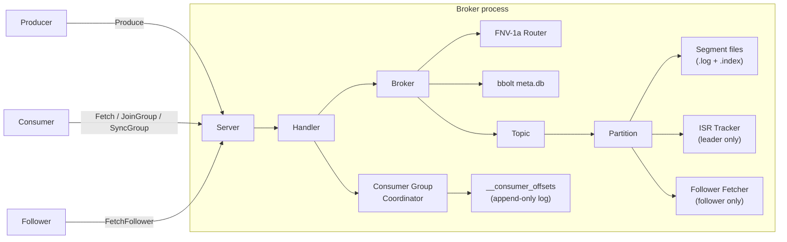

# Mini-Kafka

> A from-scratch implementation of a durable, partitioned, replicated pub/sub system in Go. Segment files, sparse index, CRC validation, custom binary TCP protocol, FNV-1a partition routing, consumer groups with range assignment, ISR replication, and a 3-broker Docker Compose cluster. No Kafka client library used.

[](https://github.com/Utkarsh272/mini-kafka/actions)
[](https://go.dev)
[](LICENSE)

[What's built](#whats-built) · [Architecture](#architecture) · [Quick start](#quick-start) · [Cluster](#cluster) · [Design decisions](DESIGN.md) · [Roadmap](#roadmap)

---

## What & Why

Most engineers use Kafka. Very few have built one.

Mini-Kafka is a ground-up implementation of the core Kafka primitives — not a wrapper, not a toy that stops at "here's a queue." Every byte on disk, every field in the wire protocol, every routing decision, every consumer group state transition, and every replication handshake is written from scratch.

The goal: understand the exact engineering decisions behind one of the most influential pieces of distributed infrastructure in modern software, by implementing it.

---

## What's Built

### Storage layer (`internal/storage`)

- **Segment files** — each partition is a directory of `.log` + `.index` file pairs named by base offset. Segments roll at 1 MB.
- **Sparse index** — one `[relativeOffset: 4B][bytePosition: 4B]` entry per 512 bytes. Reads binary-search the index, then scan forward — O(log n) seek.
- **CRC32 validation** — every record carries a CRC32/IEEE checksum computed on write, validated on every read. Corrupted bytes return an error.
- **Recovery on reopen** — `OpenLog` walks existing `.log` files to recover `nextOffset` without a separate WAL.
- **`WriteAt`-based appends** — no `O_APPEND`. Byte position tracked explicitly so reads and writes share the same file descriptor under a mutex.

**Record format** (binary, big-endian):
```
[length: 4B][offset: 8B][timestamp: 8B][crc32: 4B][key_len: 4B][key][value_len: 4B][value]
```

### Broker layer (`internal/broker`)

- **FNV-1a partition routing** — keyed records hash to a stable partition (same key → same partition → ordering preserved). Keyless records round-robin via a per-topic `atomic.Uint64`.
- **bbolt metadata persistence** — topic configs survive broker restarts. On startup, bbolt is replayed and partition logs reopened.
- **ISR tracker** — leader partitions track each follower's fetch offset and last-fetch time. High-watermark = min(LEO across ISR). Followers shrink out of ISR on time or record lag; re-join when caught up.

### Consumer groups (`internal/consumer_group`)

Full implementation of the Kafka consumer group protocol:

- **State machine** — `Empty → PreRebalance → AwaitingSync → Stable`
- **JoinGroup** — connection goroutine parks during a 500ms rebalance delay window (exactly like Kafka) while all members join
- **SyncGroup** — leader submits assignment; coordinator auto-computes via range assignor if leader sends empty
- **Range assignor** — `⌈partitions / members⌉` contiguous partitions per topic, deterministic (sorted member IDs)
- **Heartbeat / LeaveGroup** — generation validation, session timeout tracking, background reaper
- **Durable offset store** — committed offsets written to an append-only log (`__consumer_offsets`), replayed on restart

### Replication (`internal/replication`)

- **FollowerFetcher** — background goroutine on each follower that maintains a persistent TCP connection to the leader, continuously fetches records via `FetchFollower` (API key 8), appends to the local log, and reconnects on failure with backoff
- **ISRTracker** — leader-side ISR membership: `RecordFetch` updates follower progress, `ShrinkISR` evicts lagging replicas, `HighWatermark` returns min(ISR offsets)
- **Read-committed** — consumers only see records up to the high-watermark

### Wire protocol (`internal/protocol`)

Custom binary protocol over TCP. All integers big-endian.

```
Request:  [length: 4B][api_key: 1B][correlation_id: 4B][client_id_len: 2B][client_id][payload]
Response: [length: 4B][correlation_id: 4B][error_code: 2B][payload]
```

All 12 API keys implemented:

| Key | Name | Key | Name |
|-----|------|-----|------|
| 0 | Produce | 6 | OffsetCommit |
| 1 | Fetch | 7 | OffsetFetch |
| 2 | Metadata | 8 | FetchFollower |
| 3 | JoinGroup | 9 | LeaveGroup |
| 4 | SyncGroup | 10 | CreateTopic |
| 5 | Heartbeat | 11 | DescribeGroup |

### TCP server (`internal/server`)

- Goroutine-per-connection with `bufio` buffering on read and write
- `partitionID = -1` in Produce → broker routes via key hash or round-robin
- Correlation IDs enable client-side request pipelining
- Graceful shutdown via `sync.WaitGroup`

---

## Architecture



### On-disk layout

```
<data-dir>/
├── meta.db                          # bbolt: topic configs
├── __consumer_offsets/              # durable committed offsets
│   ├── 00000000000000000000.log
│   └── 00000000000000000000.index
├── orders-0/                        # topic "orders", partition 0
│   ├── 00000000000000000000.log
│   ├── 00000000000000000000.index
│   └── 00000000000000001024.log     # rolled at 1 MB
└── orders-1/
    └── ...
```

---

## Quick Start

```bash
git clone https://github.com/Utkarsh272/mini-kafka
cd mini-kafka

# Build
make build

# Run single-broker smoke test (no Docker needed)
make demo

# Run all tests
make test

# Run with race detector
make test-race
```

### Single broker (manual)

```bash
./bin/broker --addr=:9092 --data-dir=/tmp/mini-kafka --node-id=1 --host=localhost
```

### Throughput benchmark

```bash
# Start a broker first, then:
make bench
# Reports msg/sec and MB/sec for 100K messages
```

---

## Cluster

### Start a 3-broker cluster

```bash
make up
```

This builds the Docker image and starts:

| Service | Address |
|---------|---------|
| Broker 1 | `localhost:9092` |
| Broker 2 | `localhost:9093` |
| Broker 3 | `localhost:9094` |
| Prometheus | `http://localhost:9090` |
| Grafana | `http://localhost:3000` (admin/admin) |

```bash
make down    # stop cluster
make logs    # tail logs
make clean   # stop + remove volumes
```

### How replication works in the cluster

Broker startup with `--peers=2:broker-2:9093,3:broker-3:9094`:

1. Load all topics from bbolt
2. For each partition with RF > 1, compute leader using `(partID % clusterSize) + 1`
3. Leader partitions → attach `ISRTracker`
4. Follower partitions → start `FollowerFetcher` pointed at leader

Followers continuously fetch via `FetchFollower` (API key 8). The leader advances the high-watermark as followers report progress. Consumers only read records up to the high-watermark.

---

## Testing

| Package | What's covered |
|---------|---------------|
| `internal/storage` | Record encode/decode, CRC corruption, segment append/read/reopen, log rolling, cross-segment reads, 10K record volume |
| `internal/broker` | FNV-1a hash stability, round-robin distribution, topic CRUD, metadata persistence across restarts |
| `internal/consumer_group` | Full Join+Sync cycles, range assignor (1/2/3 members, more members than partitions), heartbeat, leave+rebalance, offset persistence |
| `internal/replication` | ISR high-watermark, follower lag shrink/rejoin, time-based eviction, wire encode/decode roundtrip |
| `internal/server` | TCP integration — all 12 API keys, auto-route produce, correlation IDs |

```bash
make test        # all packages
make test-race   # with race detector
make test-short  # skip large-volume tests
```

---

## Design Decisions

Full write-up in [DESIGN.md](DESIGN.md). Key choices:

- **`WriteAt` not `O_APPEND`** — `O_APPEND` ignores `Seek()`, breaking corruption tests. Explicit position tracking is equally correct under a mutex.
- **FNV-1a routing** — same algorithm as Kafka's `DefaultPartitioner`. Fast, stable, good distribution.
- **Blocking JoinGroup** — goroutine parks during rebalance window. Simple, correct, and exactly what Kafka does.
- **bbolt for metadata, log for offsets** — metadata is read-heavy and rarely written (B+ tree fits). Offsets are high-frequency appends (log fits).
- **Static leader assignment** — `(partID % clusterSize) + 1`. Deterministic, zero coordination overhead. Documented trade-off vs KRaft.
- **`openTopic` before `saveTopic`** — orphaned log dirs on crash are harmless; bbolt missing a record on crash would fail replay.

---

## Roadmap

| Days | Goal | Status |
|------|------|--------|
| 1–2 | Segment files, sparse index, CRC, Log | ✅ |
| 3–4 | Wire protocol, TCP server, Produce/Fetch/Metadata | ✅ |
| 5–6 | FNV-1a routing, bbolt metadata persistence | ✅ |
| 7–9 | Consumer groups, range assignor, durable offset store | ✅ |
| 10–12 | ISR replication, FollowerFetcher, FetchFollower API | ✅ |
| 13–14 | Docker Compose cluster, Makefile, smoke test, DESIGN.md | ✅ |
| 15 | CLI: `mk produce`, `mk consume`, `mk topics`, `mk groups` | 🔲 |
| 16–17 | Next.js + TypeScript dashboard (lag, ISR, msgs/sec) | 🔲 |
| 18 | Prometheus metrics, Grafana dashboards, load benchmark | 🔲 |

---

## Tech Stack

| Layer | Choice |
|-------|--------|
| Language | Go 1.23 |
| Storage | `os.File` + custom binary serialization |
| Metadata | `go.etcd.io/bbolt` |
| Wire protocol | Custom binary TCP |
| Cluster | Docker Compose (3 brokers) |
| Observability | Prometheus + Grafana (wired, metrics endpoint coming Day 18) |
| Dashboard (planned) | Next.js + TypeScript + Recharts |

---

## License

MIT
